# Arm Keil Studio for VS Code

###### `vcpkg-configuration.json`**&#x20;** list all tools for use in project.

###### `tasks.json` automates tasks:

&#x20;   https://mdk-packs.github.io/vscode-cmsis-solution-docs/configuration.html#configure-a-build-task

&#x20;   Specially, in CMSIS-Solution, we can configure the build-task (tasks.json) to build projects (control the build process).

&#x20;   For more detail : https://code.visualstudio.com/docs/debugtest/tasks

###### `*.csolution.yml`  is for a whole solution, inside it will be several projects that contains `*cproject.yml`

To change root folder of **Vcpkg**:

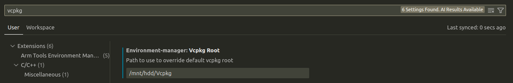

Inside **\~/.vcpkg/vcpkg-init&#x20;**&#x6D;odif&#x79;**&#x20;VCPKG\_ROOT**:

```
export VCPKG_ROOT=/mnt/hdd/Vcpkg
```

and reinit vcpkg: 

```
. ~/.vcpkg/vcpkg-init
```

More detail here:

https://learn.arm.com/learning-paths/embedded-and-microcontrollers/vcpkg-tool-installation/

## Base project creation

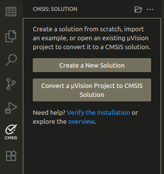

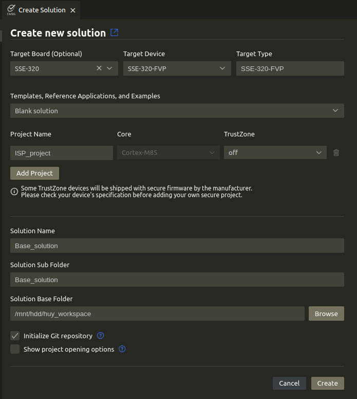

Overview project structure:

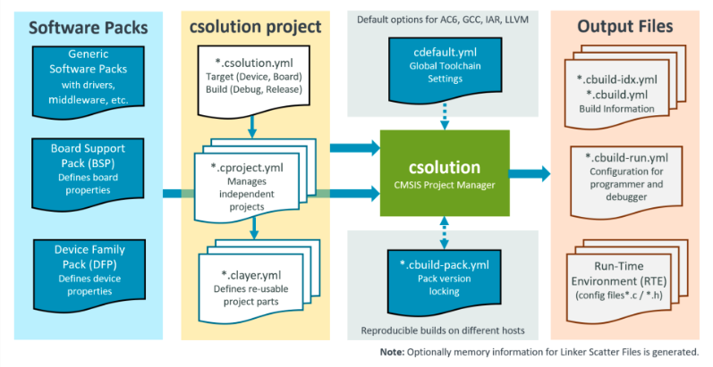


Basic packs or prerequisited packs:

```yaml
  # List the packs that define the device and/or board.
  packs:
    - pack: ARM::SSE_320_BSP
    - pack: ARM::CMSIS
```

Add tools to project inside `vcpkg-configuration.json` :

This is source view

```json
{
 "registries": [
  {
   "name": "arm",
   "kind": "artifact",
   "location": "https://artifacts.tools.arm.com/vcpkg-registry"
  }
 ],
 "requires": {
  "arm:tools/open-cmsis-pack/cmsis-toolbox": "2.10.0",
  "arm:tools/kitware/cmake": "3.31.5",
  "arm:tools/ninja-build/ninja": "1.12.1",
  "arm:tools/arm/mdk-toolbox": "1.1.0",
  "arm:compilers/arm/armclang": "6.24.0",
  "arm:compilers/arm/arm-none-eabi-gcc": "14.3.1",
  "arm:debuggers/arm/armdbg": "6.6.0",
  "arm:models/arm/avh-fvp": "11.29.27"
 }
}
```

This is preview

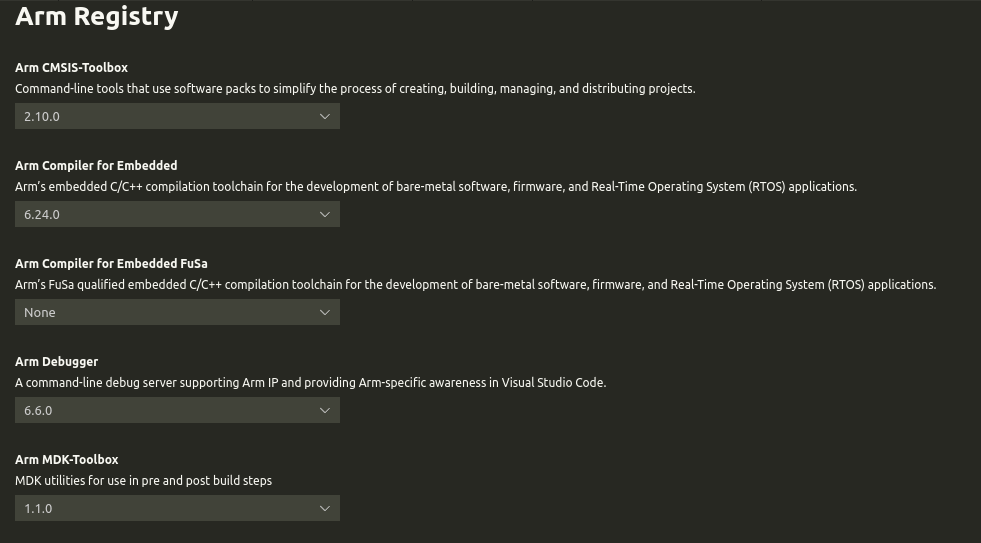

ARM keil IDE will automatically create tasks, and locate tasks inside `.vscode/tasks.json`, for every action like RUN, LOAD or DEBUG it will have corresponded task, let's modify RUN action:

```json
        {
            "label": "CMSIS Run",
            "type": "shell",
            "command": "/opt/vlsi/arm/tools/FVP_Corstone_SSE-320/models/Linux64_GCC-9.3/FVP_Corstone_SSE-320",
            "options": {
                "cwd": "${workspaceFolder}/"
            },
            "windows": {
                "options": {
                    "shell": {
                        "executable": "cmd.exe",
                        "args": [
                            "/d",
                            "/c"
                        ]
                    }
                }
            },
            "linux": {
                "options": {
                    "shell": {
                        "executable": "/bin/bash",
                        "args": [
                            "-c"
                        ]
                    }
                }
            },
            "osx": {
                "options": {
                    "shell": {
                        "executable": "/bin/bash",
                        "args": [
                            "-c"
                        ]
                    }
                }
            },
            "args": [
                "-C", "mps4_board.subsystem.ethosu.num_macs=1024", 
                "-C", "mps4_board.visualisation.disable-visualisation=1", 
                "-C", "vis_hdlcd.disable_visualisation=1",
                "${command:arm-debugger.getApplicationFile}"
            ],
            "problemMatcher": []
        },
```

Default command for RUN action is pyocd, but for Ubuntu 22, GLIB that openocd used is not compatible, so, for RUN action to run, modify command to local FVP (/opt/vlsi/arm/tools/FVP\_Corstone\_SSE-320/models/Linux64\_GCC-9.3/FVP\_Corstone\_SSE-320)


To prevent IDE re-modify tasks.json, in VScode go Ctrl+Shift+P -> Configure task -> CMSIS Load+Run, modify it and tasks.json will never be changed!

To manage software components:

&#x20;Open the **CMSIS view&#x20;**&#x61;nd click


to open the view:

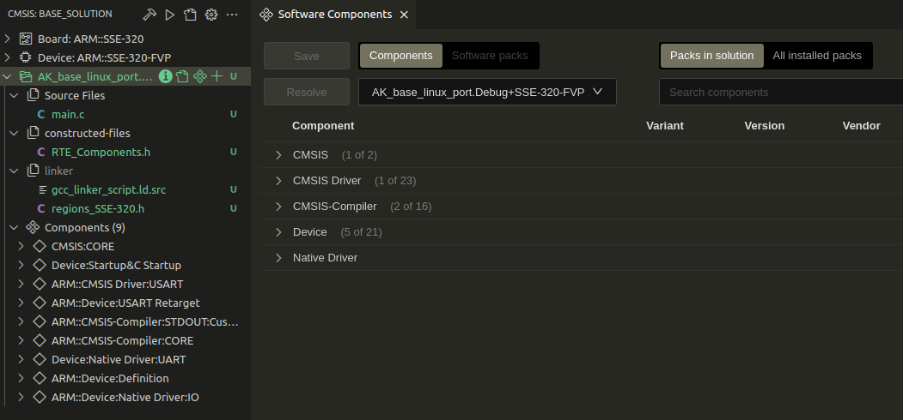

#### Add debugger(ARM debugger):

https://marketplace.visualstudio.com/items?itemName=Arm.arm-debugger

1. Install the[Arm Debugger VS Code extension](https://marketplace.visualstudio.com/items?itemName=Arm.arm-debugger).
2. Add the Arm Debugger to your`vcpkg-configuration.json`file, for example:
   `"arm:debuggers/arm/armdbg": "6.6.0"`

The following JSON files are created automatically:

* In the`launch.json`file,`attach`and`launch`configurations are added that let you attach the debug adapter to an already running GDB instance (for example when you have issued a`load and run`before) or launch a new debug session.
* In the`tasks.json`file, the tasks`CMSIS Erase`,`CMSIS Load`, and`CMSIS Run`are created.

Debugger is defined in `launch.json`, open launch.json in preview mode and config.

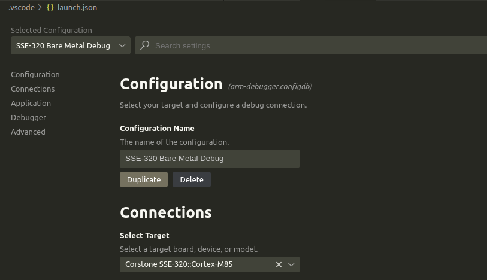

In the CMSIS tab, click run button results:

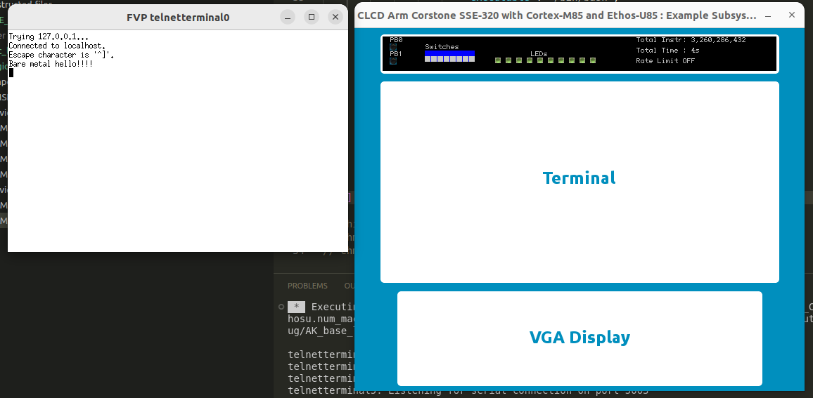

Buttons, switches, leds on CLCD corresponding to real hardware MPS4: https://developer.arm.com/documentation/102577/latest/

SSE-320 ref-manual: https://documentation-service.arm.com/static/66faaf171669c0388dca6f8e?token=

* User board components:
  * 10 user LEDs - Active-LOW
  * 8 user switches - Active-HIGH
  * 2 user push buttons - Active-LOW

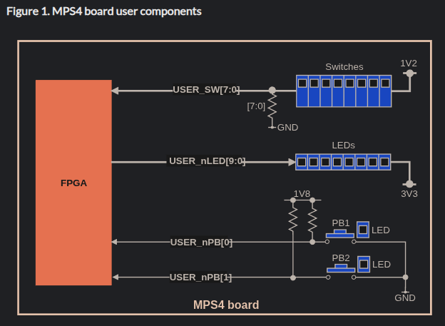

* **Switches** 

Eight white boxes show the state of the User DIP switches. These white boxes represent switches on the MPS4 hardware, which are mapped to register **SWITCH(0x28)** of System Control and I/O block. The switches are in the off position by default. To change its state, click in the area above or below a white box.

* **LEDs** 

Eight colored boxes indicate the state of the MPS4 User LEDs. These colored boxes represent the red/yellow/green LEDs on the MPS4 hardware, which are mapped to register **LED0(0x0)** of System Control and I/O block.

* **Push Buttons&#x20;**

Two Push-Buttons PB0 and PB1. They are asserted when pressed and deasserted when released. These represent push-buttons on the MPS4 hardware, which are mapped to register **BUTTON(0x08)** of System Control and I/O block.

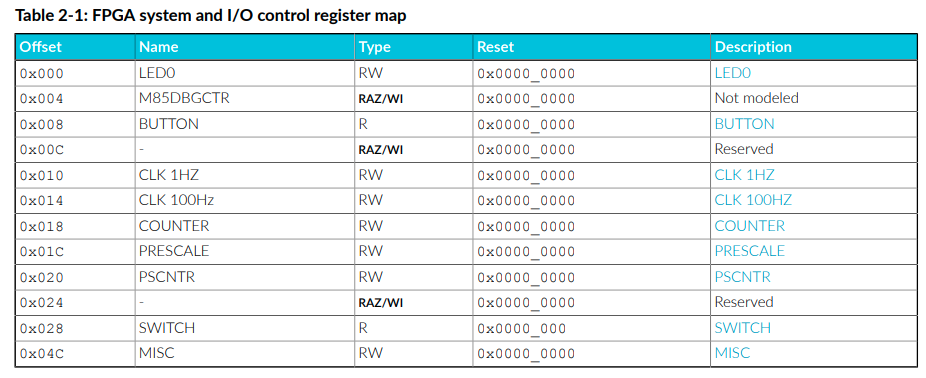

Build and run simple buttons and leds control:

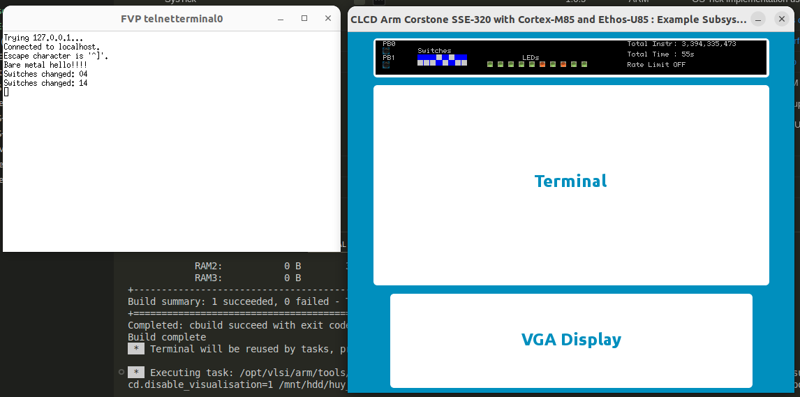


All ARM and CMSIS source codes are located in **/mnt/hdd/Vcpkg**.
